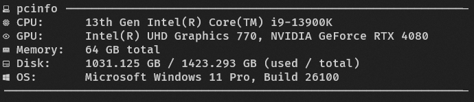

# PcInfo

This is a simple script that shows a quick summary of your Windows system's hardware and OS meta data.  
The script output relies on nerd font symbols (https://www.nerdfonts.com/#home) to display icons.

## output

By default, the output is formatted like this:  

It's a very simple script. To modify the output to your liking, just edit the output in [PcInfo.ps1](./PcInfo.ps1) at the end of the script.
